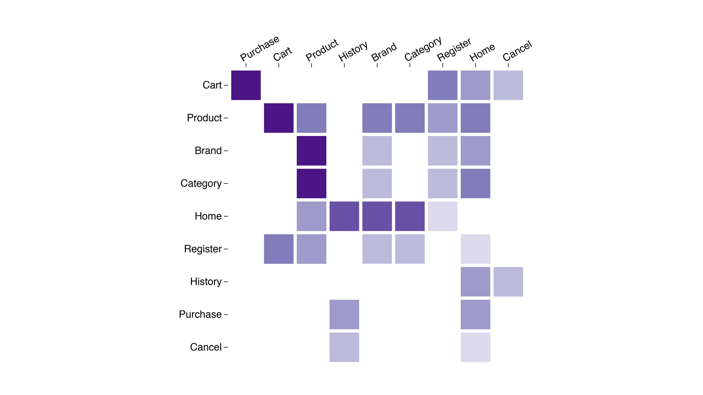

### Example Charts

 1. [Area Range](#area-range) – display range of values
 1. [Boxplot](#boxplot) - summarize distributions of data
 1. [Bubble Scatterplot](#bubble-scatterplot) - display relationships between a number of dimensions on a measure
 1. [Calendar](#calendar) - display a heatmap of daily data
 1. [Chord](#chord) - display relationships between two dimensions
 1. [Collapsible Tree](#collapsible-tree) - visualize a hierarchy
 1. [Heatmap](#heatmap) - two dimensional display of tabular data highlighting correlations
 1. [Histogram](#histogram) - visualize distributions
 1. [Matrix](#matrix) - a reorderable heatmap visualization for a matrix
 1. [Sankey](#sankey) - display sequences of transitions
 1. [Spiderweb](#spiderweb) - compare measures across multiple of dimensions
 1. [Sunburst](#sankey) - display hierarchical data in a nested structure
 1. [Treemap](#treemap) - hierarchical display of a measure
 1. [Waterfall](#waterfall) - cumulative effect of sequential deltas

# Area Range

# Boxplot

# Bubble Scatterplot

# Calendar

# Chord

# Collapsible Tree

# Heatmap

# Histogram

# Matrix

# Sankey

# Spiderweb

# Sunburst

# Treemap

# Waterfall

