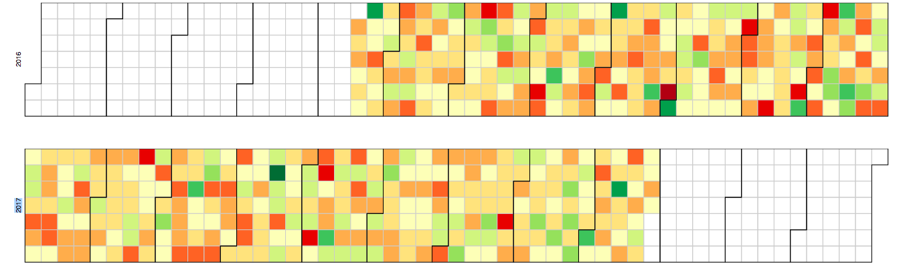
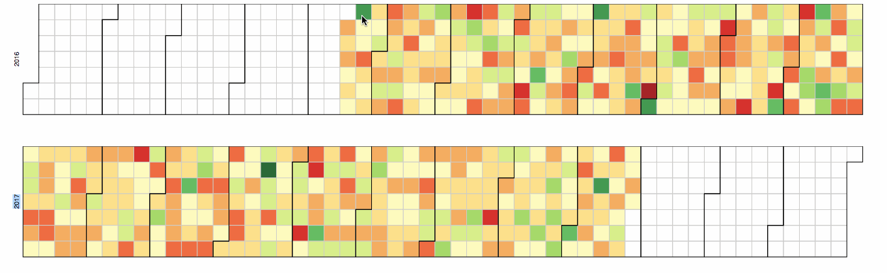

#  Calendar

This diagram creates a [calendar view](https://bl.ocks.org/mbostock/4063318), show a heatmap of a measure across time.

**How it works**

Create a look with one measure and one date dimensions.

For example, in the calendar view featured above, an average order price across time is displayed.

Include [calendar.js](/calendar.js), [calendar_view.js](/calendar_view.js), [utils.js](../common/utils.js) and [d3.v4.js](../common/d3.v4.js)
