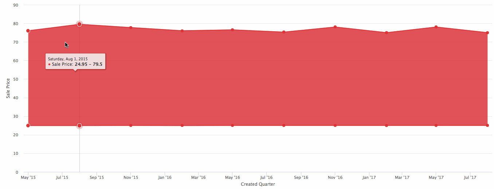
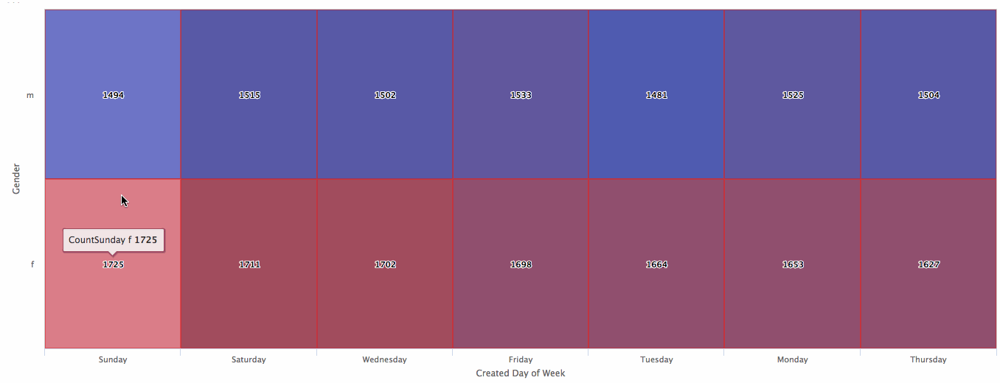
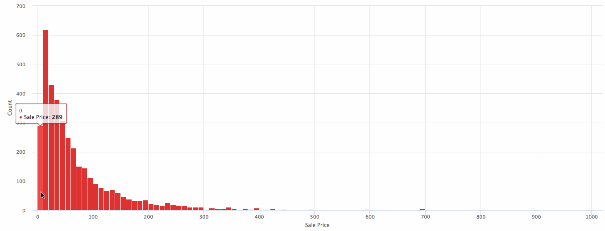
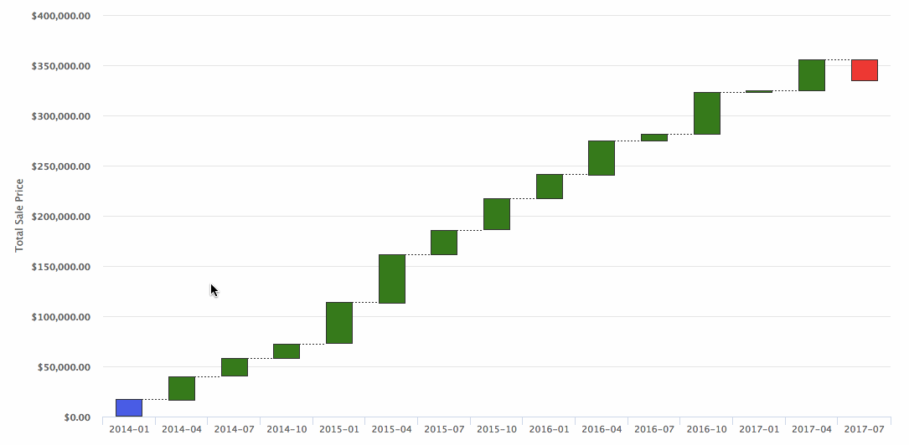

#  Highcharts

These visualizations show how to utilize the powerful [Highchart javascript library](https://www.highcharts.com/) in Looker custom visualizations.

### Example Charts

 1. [Area Range](#area-range) – display range of values
 1. [Boxplot](#boxplot) - summarize distributions of data
 1. [Bubble Scatterplot](#bubble-scatterplot) - display relationships between a number of dimensions on a measure
 1. [Heatmap](#heatmap) - two dimensional display of tabular data highlighting correlations
 1. [Histogram](#histogram) - visualize distributions
 1. [Spiderweb](#spiderweb) - compare measures across multiple of dimensions
 1. [Treemap](#treemap) - hierarchical display of a measure
 1. [Waterfall](#waterfall) - cumulative effect of sequential deltas

# Area Range

#### How it works

Create a look with one dimension and two measures typically a high and low value.

For example, in the area-range diagram featured above, it displays the min and max average sale price for an ecommerce store over time.

# Boxplot

A [Boxplot](https://en.wikipedia.org/wiki/Box_plot) is a means to visualize the distribution of groups of data through quartiles.

#### How it works

Create a look with one dimension and five measures (minimum value, first quartile, median, third quartile and maximum.

For example, in the boxplot featured above, it displays the quartiles of the sale price for brands of an ecommerce store.

# Bubble Scatterplot

A [scatterplot](https://en.wikipedia.org/wiki/Scatter_plot) is a useful visualization to display the relationship between across multiple dimensions of data. two dimension displays of X and Y can show correlations on an underlying measure. By layering a Z axis and further series, the relationship between more metrics can be displayed.

#### How it works

Create a look with one dimension for the x axis and optionally a pivoted dimension for multiple series and two measures, the first for the y axis and the second for the size of a point.

For example, in the bubble scatterplot featured above, it displays the total sale price for an ecommerce store on the y axis over time on the x axis. The points are sized by the average basket size on that day and the colors of the points correspond to the department (Men's or Women's) for the purchased items.

# Heatmap

A [heatmap](https://en.wikipedia.org/wiki/Heat_map) is a useful way to visualize trends and relationships within data.

#### How it works

Create a look with two dimensions (x and y) and one measure to create two dimensional heatmap.

For example, the heatmap featured above, the total number of orders is displayed across the day of the week and gender of the user. This allows for trends like a day of the week effect to be displayed with differential effects across gender.

# Histogram

A [Histogram](https://en.wikipedia.org/wiki/Histogram) is a useful way to visualize distributions of data.

#### How it works

Create a look with one dimension to generate a Histogram of the returned results.

For example, the Histogram featured above, see the distribution of sales price for every purchased item.

# Spiderweb

A [Spiderweb](https://en.wikipedia.org/wiki/Radar_chart) or Radar chart is a useful way to multivariate data across a dimension.

#### How it works

Create a look with one dimension and one or more measures to generate a Spiderweb.

For example, the Spiderweb featured above, see the average sale price and profit per category of an ecommerce store.

# Treemap

This diagram creates a [Treemap](https://en.wikipedia.org/wiki/Treemapping) to display hierarchical data in a nested structure.

#### How it works

Create a look with any amount of dimensions and one measure.

For example, in the Treemap featured above, you can see order counts by the hierarchical product department and category.

# Waterfall

This diagram creates a [Waterfall](https://en.wikipedia.org/wiki/Waterfall_chart) helps in understanding the cumulative effect of sequentially introduced positive or negative delta values.

#### How it works

Create a look with one dimensions and one measure.

For example, in the Waterfall featured above, you can see an initial total sale price amount quarterly deltas and a final total sale price amount.

Include each js, [utils.js](../common/utils.js), [highcharts.js](../common/highcharts.js) and [d3.v4.js](../common/d3.v4.js)

