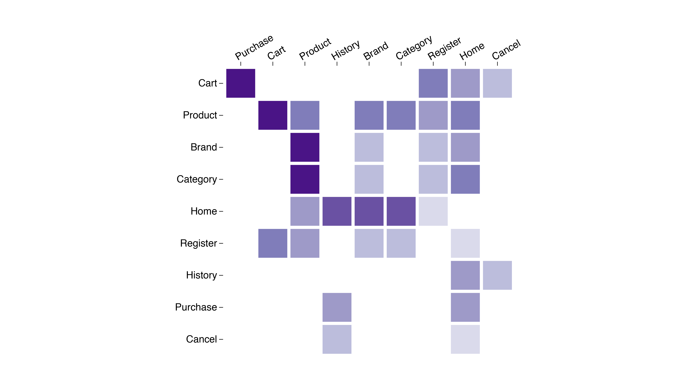

#  Matrix

This diagram creates a reorderable matrix [heatmap](https://en.wikipedia.org/wiki/Heat_map) to display correlations between dimensions on a shared measure.

**How it works**

Create a look with two dimensions and one measure.

For example, in the matrix featured above, you can see a heatmap of event transition counts and the various states along the rows and columns.

Include [matrix.js](/matrix.js), [utils.js](../common/utils.js), and [d3.v4.js](../common/d3.v4.js)
