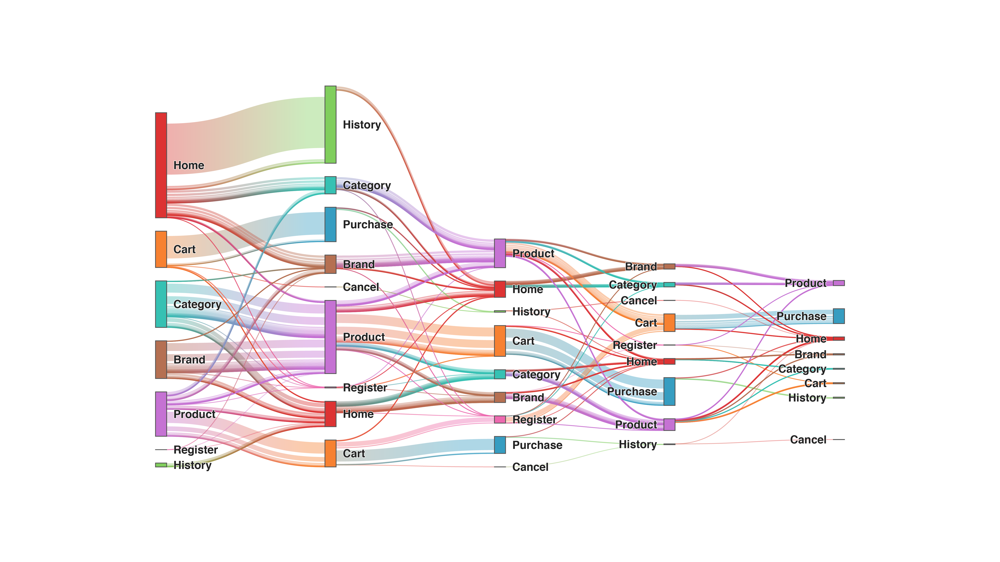

#  Sankey

This diagram creates a [sankey diagram](https://en.wikipedia.org/wiki/Sankey_diagram) to display sequences of transitions.

**How it works**

Create a look with any number of dimensions and one measure.

For example, in the sankey diagram above, you can see event transition counts between the various sequences of states.

Include [sankey.js](/sankey.js), [d3.sankey.js](/d3.sankey.js),, [utils.js](../common/utils.js), and [d3.v4.js](../common/d3.v4.js)
