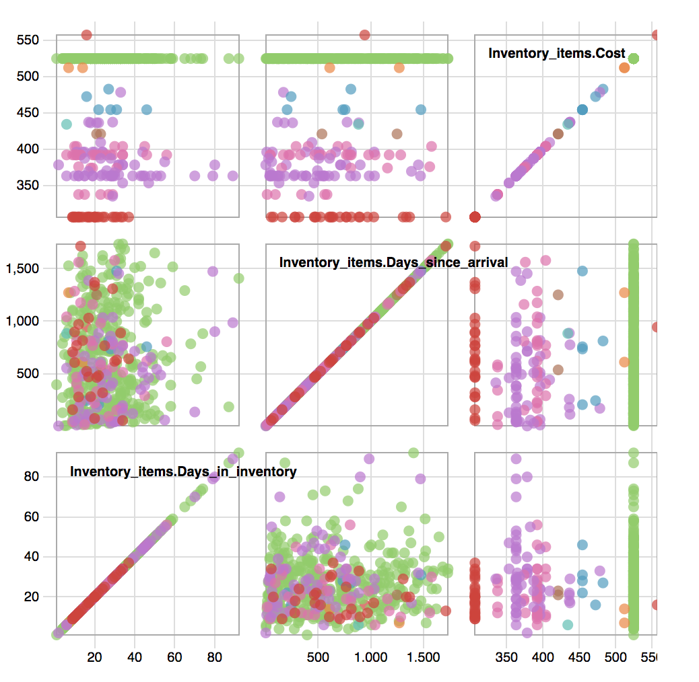
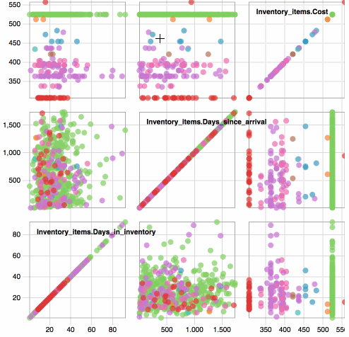

#  Scatter Plot Matrix

This diagram creates a [scatterplot matrix](https://bl.ocks.org/mbostock/4063318), showing the a scatterplot of multiple dimensions.

**How it works**

Create a look with as many numeric dimensions and up to one non-numeric dimension as a category to color points by.

For example, in the scatterplot matrix above the relationship between days in inventory, days since arrival and cost is displayed.

Include [scatterplot_matrix.js](/scatterplot_matrix.js) and[utils.js](../common/utils.js).
