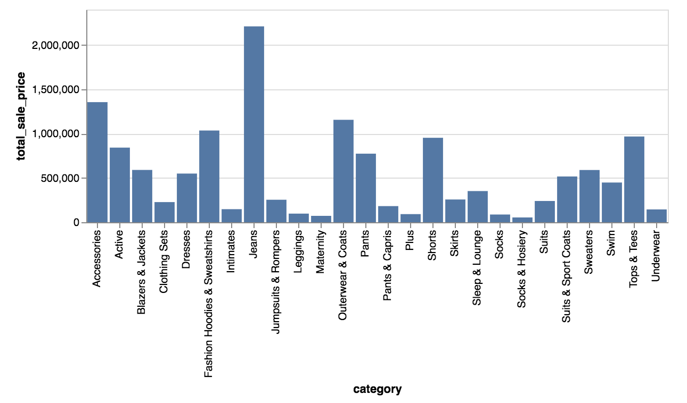

#  Vega



Takes a vega (or vega lite) [spec](https://vega.github.io/vega-lite/) and renders specified chart.

See Vega Examples for other supported visualizations https://vega.github.io/vega-lite/examples/.

**How it works**

Create a look with any dimensions or measures.

Pass a valid vega JSON spec in the visualization config

For example, the below spec on a data with a `category` and `total_sale_price` field will render the above bar chart.

```json
{
  "$schema": "https://vega.github.io/schema/vega-lite/v2.json",
  "description": "",
  "mark": "bar",
  "encoding": {
    "x": {"field": "category", "type": "nominal"},
    "y": {"field": "total_sale_price", "type": "quantitative"}
  }
}
```

The data parameter is handled by the custom visualization to pass data of the form:

```json
[
  {"category": "Jeans", "total_sale_price": 2210481},
  {"category": "Accessories", "total_sale_price": 1355342},
  ...
]
```


Include [vega.js](/vega.js), [utils.js](../common/utils.js), and [vega.min.js](../common/vega.min.js) (which contains vega, vega-lite and vega embed).
